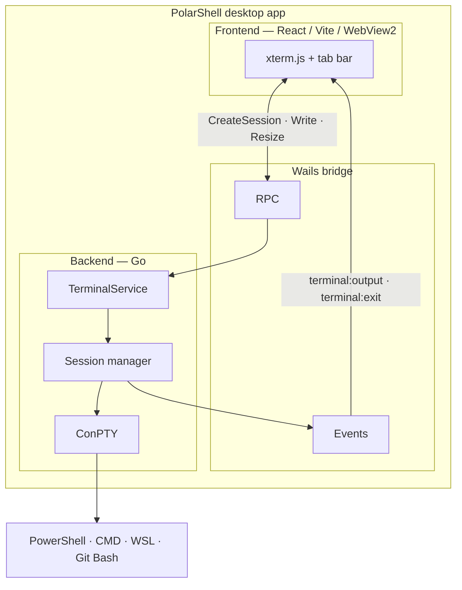

# PolarShell

PolarShell is a native **Windows desktop terminal** inspired by modern terminal apps (Windows Terminal, VS Code integrated terminal). It runs real shells through the Windows **ConPTY** API and renders them in the UI with **xterm.js**, wrapped in a lightweight **Wails v3** shell with a **React** front end.

The app is not a web page in a browser tab: it is a standalone `.exe` that embeds WebView2 for the UI while all PTY I/O runs in Go on the backend.

## Features

- **Multiple tabs** — open, switch, and close terminal sessions independently
- **Real shells** — PowerShell, CMD, WSL, and Git Bash (when available on the machine)
- **Full terminal emulation** — ANSI colors, UTF-8, cursor, scrollback, resize, copy/paste via xterm.js
- **App settings** — font, size, scrollback, default shell loaded from `%APPDATA%/PolarShell/`, plus a frontend settings area for UI preferences
- **Workspaces shell** — first-run welcome flow, sidebar navigation, and persisted workspace metadata
- **Dark UI** — Tailwind CSS + [shadcn/ui](https://ui.shadcn.com) (Base UI primitives), editor-style tab bar

## How it works



1. The frontend creates a session over RPC (`CreateSession`) with initial rows/cols.
2. The backend spawns a process attached to a pseudo-console (`github.com/rurreac/conpty`).
3. Output is pushed to the UI through Wails events (`terminal:output`).
4. Keystrokes from xterm are sent back with `Write`; window resize uses `Resize`.

Each tab owns one session. Closing a tab closes only that ConPTY session.

Open tabs (id, title, shell) and the active tab id are restored across restarts via `localStorage` (Jotai `atomWithStorage`). ConPTY sessions are always recreated on launch.

## Tech stack

| Layer | Technologies |
|-------|----------------|
| Desktop shell | [Wails v3](https://v3.wails.io), WebView2 |
| Backend | Go 1.25+, ConPTY (`rurreac/conpty`) |
| Frontend | React 19, TypeScript, **Vite**, React Compiler |
| Terminal UI | xterm.js 6 + Fit / Search / Web Links addons |
| App UI | Tailwind CSS v4, shadcn/ui (Base UI), [Jotai](https://jotai.org), [TanStack Router](https://tanstack.com/router) |

## Prerequisites

- **Windows 10/11** (amd64 or arm64)
- [Go](https://go.dev/dl/) **1.25+**
- [Node.js](https://nodejs.org/) **18+**
- [WebView2](https://developer.microsoft.com/microsoft-edge/webview2/) runtime
- Wails v3 CLI:

```bash
go install github.com/wailsapp/wails/v3/cmd/wails3@latest
```

Ensure `%USERPROFILE%\go\bin` is on your `PATH`, then verify:

```bash
wails3 doctor
```

## Development

From the repository root:

```bash
wails3 dev
```

This will:

1. Start the Vite dev server (default port **9245**, host **127.0.0.1**)
2. Wait until the dev server is reachable
3. Build and run the Go binary with hot reload

Using `127.0.0.1` instead of `localhost` avoids common Windows IPv6/`localhost` mismatches during Wails’ startup health check.

### Frontend only

```bash
cd frontend
npm install
npm run dev          # Vite on port 9245 (see vite.config.ts)
npm run build        # production bundle → frontend/dist (embedded by Go)
npm run lint         # tsc --noEmit
```

`npm run dev` runs `predev`, which clears `node_modules/.vite` to avoid stale dependency chunks after refactors or dependency updates. To clear the cache manually:

```bash
npm run clean:vite
```

### Frontend architecture

The UI uses a **feature-based** layout under `frontend/src/`:

| Area | Path | Contents |
|------|------|----------|
| **routes** | `routes/` | TanStack Router file routes (`/`, `/welcome`, `/workspace`, `/settings`) |
| **features** | `features/<name>/` | Domain UI and state: `app`, `keyboard-shortcuts`, `main-sidebar`, `settings`, `tabs`, `terminal`, `welcome`, `workspaces` |
| **shared** | `shared/` | shadcn/ui (`components/ui`), `lib/utils`, Wails bridge (`services/terminal-bridge.ts`), i18n, global hooks |
| **bindings** | `../bindings/` | Generated Wails TypeScript bindings consumed by the frontend |

Each feature uses kebab-case folders and files, typically:

```text
features/<feature>/
├── atoms/           # Jotai atoms for that domain
├── components/
├── hooks/           # Reads atoms from the same feature (or app orchestration)
├── lib/             # Feature-specific pure helpers, when needed
└── types/
```

Jotai state is split by feature. Persisted atoms use explicit `*-storage-atoms.ts` files, for example `tabs-storage-atoms.ts`, `workspaces-storage-atoms.ts`, and `main-sidebar-storage-atoms.ts`. Runtime or derived atoms use feature-specific names such as `tabs-atoms.ts` or `settings-atoms.ts`; avoid generic `atoms.ts` files for new feature state.

`app/hooks/use-terminal-app.ts` composes tab state, backend settings, available shell profiles, and keyboard shortcuts. Terminal sessions are created lazily by `terminal/hooks/use-terminal-session.ts` when a tab becomes active; restored tab metadata comes from `localStorage`, while ConPTY sessions are always recreated on launch.

The frontend uses React Compiler through `@vitejs/plugin-react` and `@rolldown/plugin-babel`. Avoid adding `useMemo`, `useCallback`, or `memo` for manual optimization unless there is a functional reason.

Internationalization lives in `shared/i18n` with locale files under `src/locales/`.

Wails TypeScript bindings live in `frontend/bindings/` (regenerate with `wails3 generate bindings`).

### Regenerate app icons (Windows taskbar / exe)

Icons are generated from `frontend/public/react-dark.svg`:

```powershell
cd build
powershell -NoProfile -File scripts/generate-app-icons.ps1
```

Then rebuild (`wails3 build` or `wails3 dev`).

## Production build

```bash
wails3 build
```

Output: `bin/polarshell.exe` (Windows GUI binary with embedded `frontend/dist` assets).

### Explorer context menu (Windows)

Add **Abrir en PolarShell** when right-clicking a folder or empty space inside a folder in File Explorer:

```powershell
cd build
powershell -NoProfile -ExecutionPolicy Bypass -File scripts/install-shell-integration.ps1
```

Remove the menu entry:

```powershell
powershell -NoProfile -ExecutionPolicy Bypass -File scripts/install-shell-integration.ps1 -Uninstall
```

Use `-ExePath` if the binary is not under `bin/polarshell.exe`. Requires no administrator rights (writes `HKCU` only).

To launch `polarshell` from any terminal, add the install or build folder to your user `PATH` (e.g. `C:\Projects\polar-shell\bin` after `wails3 build`).

Platform-specific tasks live under `build/windows/`, `build/darwin/`, etc. (Wails v3 default layout). Helper scripts: `build/scripts/` (icons, Vite wait, Explorer integration).

## Configuration

Settings are stored at:

```text
%APPDATA%/PolarShell/config.json
```

Includes default shell, font family/size, and scrollback limit.

## Supported shells

| ID | Shell | Notes |
|----|--------|--------|
| `powershell` | PowerShell | Default; `-NoLogo -NoExit` |
| `cmd` | Command Prompt | |
| `wsl` | WSL | Requires `wsl.exe` on PATH |
| `git-bash` | Git Bash | Auto-detected under Program Files |

Availability is checked at runtime; missing shells are hidden in the UI.

## Keyboard shortcuts

| Shortcut | Action |
|----------|--------|
| Ctrl+Shift+T | New terminal tab |
| Ctrl+Shift+W | Close active tab |
| Ctrl+Tab | Next tab |

## Project layout

```text
polar-shell/
├── backend/
│   ├── models/          # DTOs for RPC and events
│   ├── settings/        # JSON config on disk
│   ├── terminal/        # ConPTY, session, manager, shell resolution
│   └── events/          # Event name constants
├── frontend/
│   ├── bindings/        # Generated Wails TS bindings
│   ├── src/
│   │   ├── features/    # app, main-sidebar, settings, tabs, terminal, welcome, workspaces
│   │   ├── routes/      # TanStack Router file routes
│   │   ├── shared/      # components/ui, i18n, lib, hooks, services
│   │   ├── routeTree.gen.ts
│   │   └── main.tsx
│   └── public/          # Static assets (logo, fonts)
├── build/
│   ├── scripts/         # generate-app-icons, wait-for-vite, install-shell-integration
│   └── windows/         # Windows Taskfile, icon, NSIS
├── main.go              # Wails app entry (windows build tag)
└── terminalservice.go   # RPC service exposed to the frontend
```

## RPC and events

**RPC (frontend → Go):**

- `CreateSession`, `Write`, `Resize`, `CloseSession`, `GetSession`
- `ListShells`, `LoadSettings`, `SaveSettings`

**Events (Go → frontend):**

- `terminal:output` — PTY stdout/stderr chunks (`sessionId`, `data`)
- `terminal:exit` — process exited (`sessionId`, `exitCode`)

Bindings are generated into `frontend/bindings/` via `wails3 generate bindings`.

## Troubleshooting

| Issue | What to try |
|-------|-------------|
| `bind: Solo se permite un uso... 9245` | Port 9245 is in use (often a leftover `node.exe` / Vite). Stop it: `Get-NetTCPConnection -LocalPort 9245 \| ForEach-Object { Stop-Process -Id $_.OwningProcess -Force }`, then run `wails3 dev` again |
| Wails cannot reach Vite | Confirm dev server on `http://127.0.0.1:9245`; see `build/config.yml` and `FRONTEND_DEVSERVER_URL` |
| `eventcreate` / bindings module not found (Vite) | `frontend/bindings` missing (often after a failed `generate bindings` with "Acceso denegado"). Regenerate: `wails3 generate bindings -f '-buildvcs=false -gcflags=all="-l" -ldflags="-H windowsgui"' -clean=true -ts`, then `wails3 dev`. `common:dev:frontend` now generates bindings before Vite starts |
| `generate bindings` → Acceso denegado | Stop `wails3 dev`/Vite, delete `frontend/.bindings-tmp-*`, re-run generate bindings. Dev builds skip `-clean` to reduce file locks on Windows |
| Vite `Pre-transform error` / missing `.vite/deps/*.js` | Stale optimizer cache. In `frontend`: `npm run clean:vite`, then restart dev. `vite.config.ts` pre-bundles `@base-ui/react` subpaths to reduce this |
| Build fails on `Remove-Item *.syso` | Use latest `build/windows/Taskfile.yml` (removes only the current arch `.syso`) |
| Extra console window when running `bin/polarshell.exe` | Rebuild with `wails3 build` (GUI subsystem). DEV builds now use `-H windowsgui`; exe metadata uses `PolarShell` not the Wails placeholder |
| **Smart App Control** blocks `polarshell.exe` as unsafe | Expected for **unsigned** local builds. SAC is unrelated to `-H windowsgui`. For day-to-day dev: turn off SAC under **Windows Security → App & browser control → Smart App Control**, or sign the binary (see [Code signing (Windows)](#code-signing-windows) below). There is no per-app “Run anyway” while SAC is in enforcement mode |
| Tab close kills the whole app | Ensure backend session close is not double-closing ConPTY; update to latest `backend/terminal` |
| Terminal dies after ~1s on load | Usually a frontend effect lifecycle issue; session hook must depend only on stable tab/shell ids |

Run `wails3 doctor` for environment diagnostics.

## Code signing (Windows)

PolarShell builds are **not signed by default**. On Windows 11 with **Smart App Control** in enforcement mode, every fresh `bin/polarshell.exe` from `wails3 build` or `wails3 dev` can be blocked because the binary is unsigned and has no Microsoft cloud reputation — not because the app is malicious.

**Local development (simplest):** Windows Security → **App & browser control** → **Smart App Control** → **Off**. Recent Windows 11 updates allow turning SAC off without reinstalling the OS; you can turn it back on later.

**Distribution (recommended):** Sign the executable after build:

1. Obtain a code-signing certificate (commercial CA, or [Microsoft Trusted Signing](https://learn.microsoft.com/en-us/azure/trusted-signing/) for eligible projects).
2. Configure `SIGN_CERTIFICATE` or `SIGN_THUMBPRINT` in `build/windows/Taskfile.yml` (vars at the top).
3. Store the cert password: `wails3 setup signing`
4. Build, then sign:

```bash
wails3 build
wails3 task windows:sign
```

Self-signed certificates often **still** fail SAC until reputation builds; use a trusted CA for releases.

## License

MIT — see metadata in `build/config.yml`.
