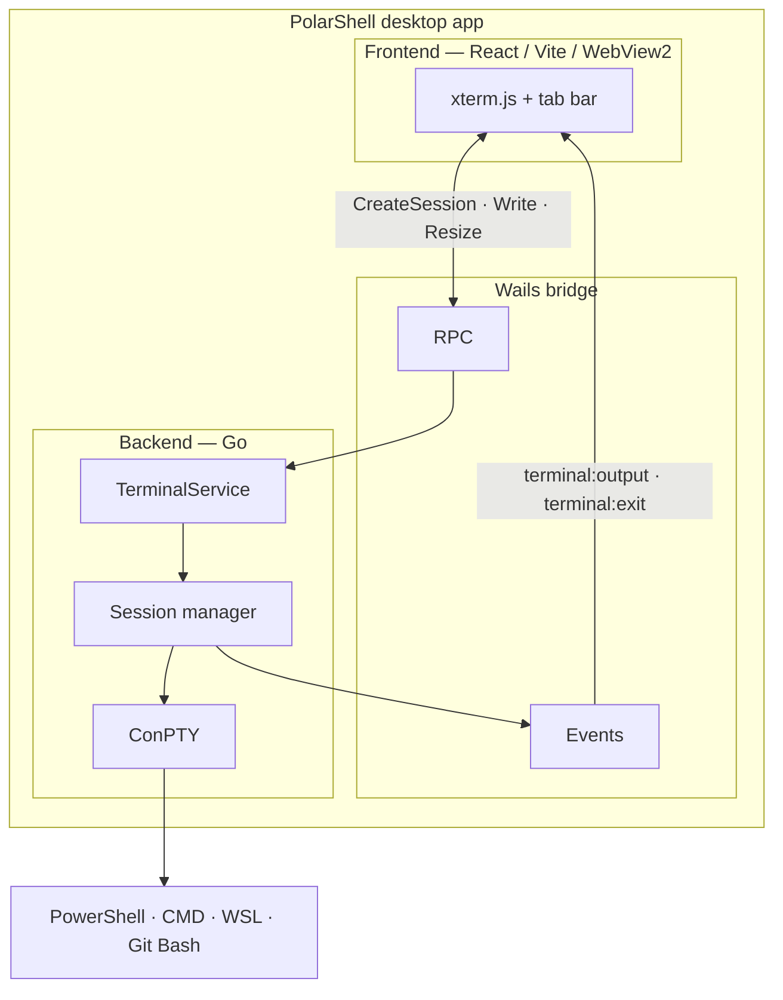

# PolarShell

PolarShell is a native **Windows desktop terminal** inspired by modern terminal apps (Windows Terminal, VS Code integrated terminal). It runs real shells through the Windows **ConPTY** API and renders them in the UI with **xterm.js**, wrapped in a lightweight **Wails v3** shell with a **React** front end.

The app is not a web page in a browser tab: it is a standalone `.exe` that embeds WebView2 for the UI while all PTY I/O runs in Go on the backend.

## Features

- **Multiple tabs** — open, switch, and close terminal sessions independently
- **Real shells** — PowerShell, CMD, WSL, and Git Bash (when available on the machine)
- **Full terminal emulation** — ANSI colors, UTF-8, cursor, scrollback, resize, copy/paste via xterm.js
- **Profiles sidebar** — quick launch for installed shells
- **Settings** — font, size, scrollback, default shell; persisted under `%APPDATA%/PolarShell/`
- **Command palette** — keyboard-driven actions
- **Dark UI** — Tailwind CSS + [shadcn/ui](https://ui.shadcn.com) (Base UI primitives), editor-style tab bar

## How it works



1. The frontend creates a session over RPC (`CreateSession`) with initial rows/cols.
2. The backend spawns a process attached to a pseudo-console (`github.com/rurreac/conpty`).
3. Output is pushed to the UI through Wails events (`terminal:output`).
4. Keystrokes from xterm are sent back with `Write`; window resize uses `Resize`.

Each tab owns one session. Closing a tab closes only that ConPTY session.

## Tech stack

| Layer | Technologies |
|-------|----------------|
| Desktop shell | [Wails v3](https://v3.wails.io), WebView2 |
| Backend | Go 1.25+, ConPTY (`rurreac/conpty`) |
| Frontend | React 18, TypeScript, **Vite** |
| Terminal UI | xterm.js 6 + Fit / Search / Web Links addons |
| App UI | Tailwind CSS v4, shadcn/ui (Base UI), Zustand |

## Prerequisites

- **Windows 10/11** (amd64 or arm64)
- [Go](https://go.dev/dl/) **1.25+**
- [Node.js](https://nodejs.org/) **18+**
- [WebView2](https://developer.microsoft.com/microsoft-edge/webview2/) runtime
- Wails v3 CLI:

```bash
go install github.com/wailsapp/wails/v3/cmd/wails3@latest
```

Ensure `%USERPROFILE%\go\bin` is on your `PATH`, then verify:

```bash
wails3 doctor
```

## Development

From the repository root:

```bash
wails3 dev
```

This will:

1. Start the Vite dev server (default port **9245**, host **127.0.0.1**)
2. Wait until the dev server is reachable
3. Build and run the Go binary with hot reload

Using `127.0.0.1` instead of `localhost` avoids common Windows IPv6/`localhost` mismatches during Wails’ startup health check.

### Frontend only

```bash
cd frontend
npm install
npm run dev          # Vite on port 9245 (see vite.config.ts)
npm run build        # production bundle → frontend/dist (embedded by Go)
npm run lint         # tsc --noEmit
```

### Regenerate app icons (Windows taskbar / exe)

Icons are generated from `frontend/public/mediawiki-logo.svg`:

```powershell
cd build
powershell -NoProfile -File scripts/generate-app-icons.ps1
```

Then rebuild (`wails3 build` or `wails3 dev`).

## Production build

```bash
wails3 build
```

Output: `bin/polarshell.exe` (Windows GUI binary with embedded `frontend/dist` assets).

Platform-specific tasks live under `build/windows/`, `build/darwin/`, etc. (Wails v3 default layout).

## Configuration

Settings are stored at:

```text
%APPDATA%/PolarShell/config.json
```

Includes default shell, font family/size, and scrollback limit.

## Supported shells

| ID | Shell | Notes |
|----|--------|--------|
| `powershell` | PowerShell | Default; `-NoLogo -NoExit` |
| `cmd` | Command Prompt | |
| `wsl` | WSL | Requires `wsl.exe` on PATH |
| `git-bash` | Git Bash | Auto-detected under Program Files |

Availability is checked at runtime; missing shells are hidden in the UI.

## Keyboard shortcuts

| Shortcut | Action |
|----------|--------|
| Ctrl+Shift+T | New terminal tab |
| Ctrl+Shift+W | Close active tab |
| Ctrl+Tab | Next tab |
| Ctrl+Shift+P | Command palette |
| Ctrl+, | Settings |

## Project layout

```text
polar-shell/
├── backend/
│   ├── models/          # DTOs for RPC and events
│   ├── settings/        # JSON config on disk
│   ├── terminal/        # ConPTY, session, manager, shell resolution
│   └── events/          # Event name constants
├── frontend/
│   ├── src/
│   │   ├── components/  # App shell, tabs, terminal view, settings, …
│   │   ├── hooks/       # Terminal session, app settings, shortcuts
│   │   ├── services/    # Wails bindings bridge
│   │   └── stores/      # Zustand (tabs, UI state)
│   └── public/          # Static assets (logo, etc.)
├── build/               # Icons, Windows manifest, Taskfile, dev scripts
├── main.go              # Wails app entry (windows build tag)
└── terminalservice.go   # RPC service exposed to the frontend
```

## RPC and events

**RPC (frontend → Go):**

- `CreateSession`, `Write`, `Resize`, `CloseSession`, `GetSession`
- `ListShells`, `LoadSettings`, `SaveSettings`

**Events (Go → frontend):**

- `terminal:output` — PTY stdout/stderr chunks (`sessionId`, `data`)
- `terminal:exit` — process exited (`sessionId`, `exitCode`)

Bindings are generated into `frontend/bindings/` via `wails3 generate bindings`.

## Troubleshooting

| Issue | What to try |
|-------|-------------|
| Wails cannot reach Vite | Confirm dev server on `http://127.0.0.1:9245`; see `build/config.yml` and `FRONTEND_DEVSERVER_URL` |
| Build fails on `Remove-Item *.syso` | Use latest `build/windows/Taskfile.yml` (removes only the current arch `.syso`) |
| Tab close kills the whole app | Ensure backend session close is not double-closing ConPTY; update to latest `backend/terminal` |
| Terminal dies after ~1s on load | Usually a frontend effect lifecycle issue; session hook must depend only on stable tab/shell ids |

Run `wails3 doctor` for environment diagnostics.

## License

MIT — see metadata in `build/config.yml`.
